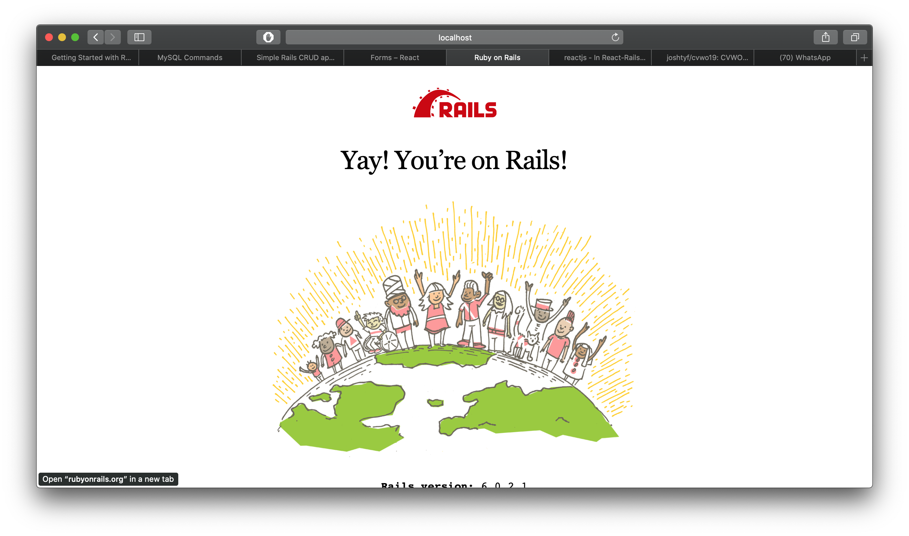

## Name and Matriculation No.
Joshua Tan Yin Feng
A0199502Y

## Overall Structure
### Controllers
- Tasks
- Categories

### Models
- Task
- Category

### Task Controller
Task controller will contain `index`, `create`, `update` and `delete` methods.

#### Index
- Will find all tasks and render

#### Create
- Will accept form data and create new task
- Return new task data to the react component which will then append it to `this.state.tasks`

#### Update
- Will accept form data and update task
- Return task data to the react component which will then update `this.state.tasks`

### REST API
Axios will help to handle all REST calls
